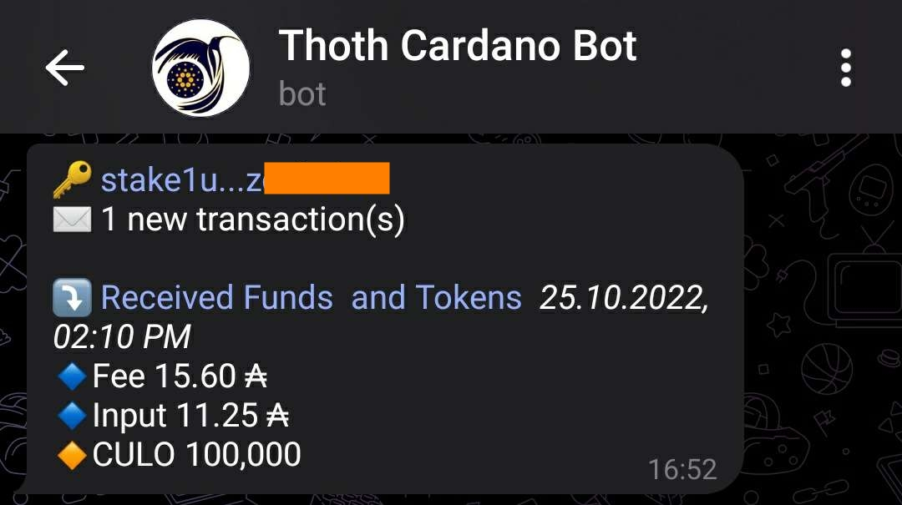
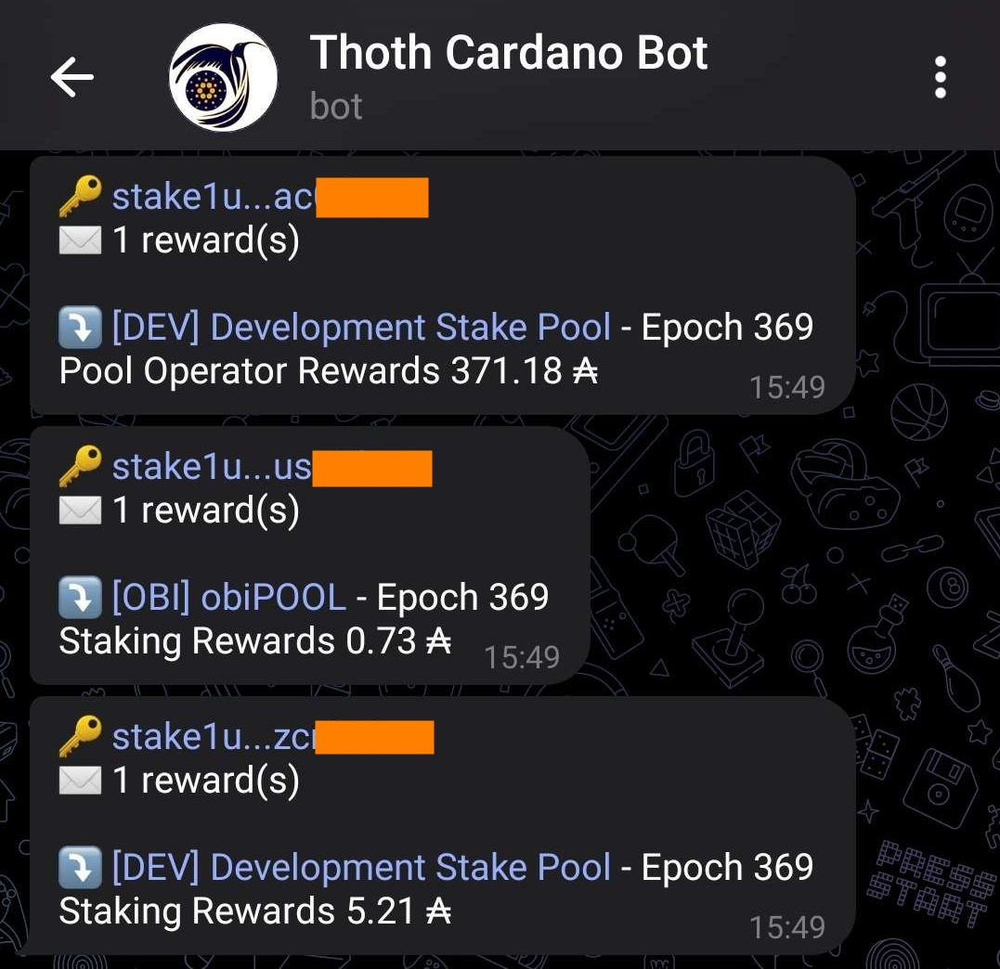
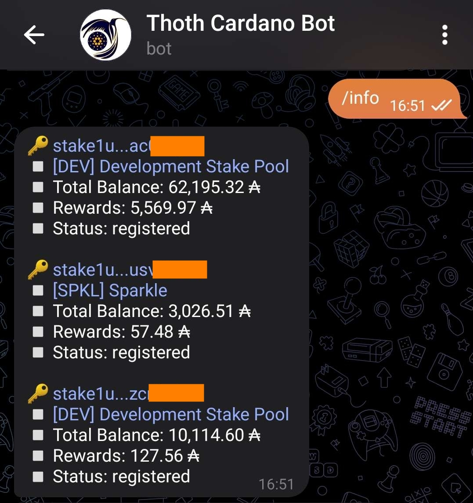

# Cardano THOTH Telegram Bot

[THOTH](https://en.wikipedia.org/wiki/Thoth) is a Telegram Bot that sends notifications about transactions, rewards,
etc. to users with Cardano accounts.

## How it works

You can find the Bot at this link: [@thoth_cardano_bot](https://t.me/thoth_cardano_bot).
Just send a command `/help` or `/start` to begin, and follow the help text!

### What to expect

Transactions notifications

Rewards notifications

Check your balance any time you want

## Author

The THOTH Bot has been implemented
by 

You can also follow the Twitter page of
Bot 

## Support

If you would like to support the Bot development, consider staking your wallet to the Stake
Pool [DEV](https://pool.pm/ca97f539e6a878e7a7d87d762982a016ac6959d76719c8212a4a39e0) that donates part of the rewards
directly to African families to support education and career development. You can also check
the [DEV Stake Pool website](https://devstakepool.github.io/) for more info.
